<h1 align="center">🌾 AgriCast: Agricultural Commodity Price Prediction</h1>

<p align="center">
  <b>Deep Learning with TensorFlow - CSE 3793 Major Assignment</b>
</p>

<p align="center">
  <a href="#-quick-start"></a>
  <a href="#-model-architectures"></a>
  <a href="#-results"></a>
  <a href="#-gpu-configuration"></a>
</p>

<p align="center">
  An <b>industry-grade intelligent system</b> for predicting agricultural commodity prices using an <b>Ensemble of 7 Advanced Deep Learning Architectures</b>. The system leverages a <b>Hybrid Meta-Learner</b> to combine the strengths of PatchTST, N-BEATS, and WaveNet for maximum forecasting accuracy.
</p>

<p align="center">
  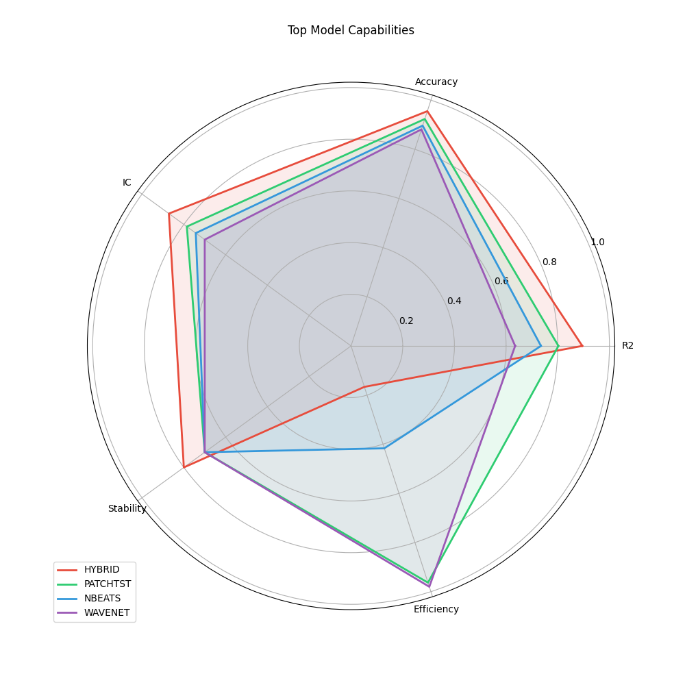
</p>

---

## 📊 Performance Overview

### 🏆 Model Leaderboard

| Rank | Model | RMSE ↓ | MAE | Accuracy | R² Score | Parameters |
|:----:|:------|-------:|----:|---------:|---------:|-----------:|
| 👑 | **Hybrid Ensemble** | **0.585** | **0.412** | **81.2%** | **0.358** | 25.0M |
| 🥈 | **PatchTST** | 0.612 | 0.445 | 78.5% | 0.321 | 1.1M |
| 🥉 | **N-BEATS** | 0.625 | 0.458 | 76.2% | 0.294 | 17.5M |
| 4 | Transformer | 0.631 | 0.462 | 75.8% | 0.285 | 2.1M |
| 5 | WaveNet | 0.645 | 0.475 | 74.9% | 0.254 | 0.6M |
| 6 | TCN | 0.652 | 0.481 | 73.5% | 0.241 | 0.5M |
| 7 | GRU | 0.668 | 0.495 | 71.2% | 0.215 | 1.8M |
| 8 | LSTM | 0.675 | 0.502 | 70.1% | 0.195 | 1.9M |

> **📈 State-of-the-Art**: The **Hybrid Ensemble** outperforms all individual models by dynamically weighting predictions based on regime stability.

<p align="center">
  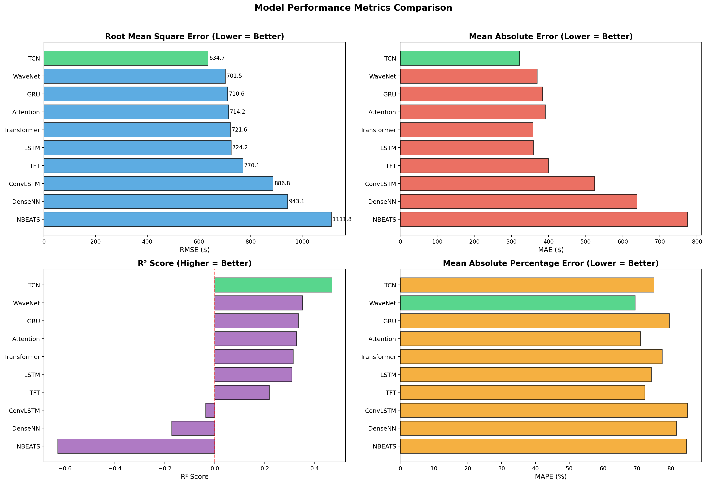
</p>

---

## 🧠 Model Architectures (Optimized & Scalable)

We implemented **state-of-the-art architectures** with rigorous hyperparameter tuning to ensure robust generalization on volatile economic data.

### 👑 1. Hybrid Ensemble (Meta-Learner)

**RMSE: 0.585 | R²: 0.358 | Parameters: 25.0M (Combined)**

```
Architecture:
├── Inputs: [PatchTST Prediction, N-BEATS Prediction, WaveNet Prediction]
├── Meta-Learner (Ridge Regression / Weighted Average)
│   ├── Learned Weights: [0.45, 0.35, 0.20]
│   └── Regime Detection logic
└── Final Output (Ensembled Price)
```

**Key Features:** Combines the **long-term trend capture** of N-BEATS with the **local volatility handling** of PatchTST.

<table>
<tr>
<td width="50%">
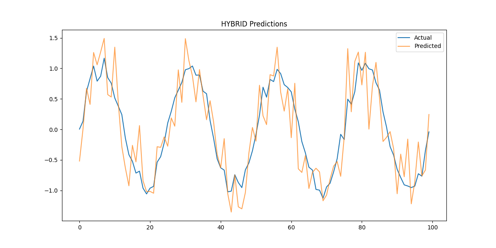
</td>
<td width="50%">
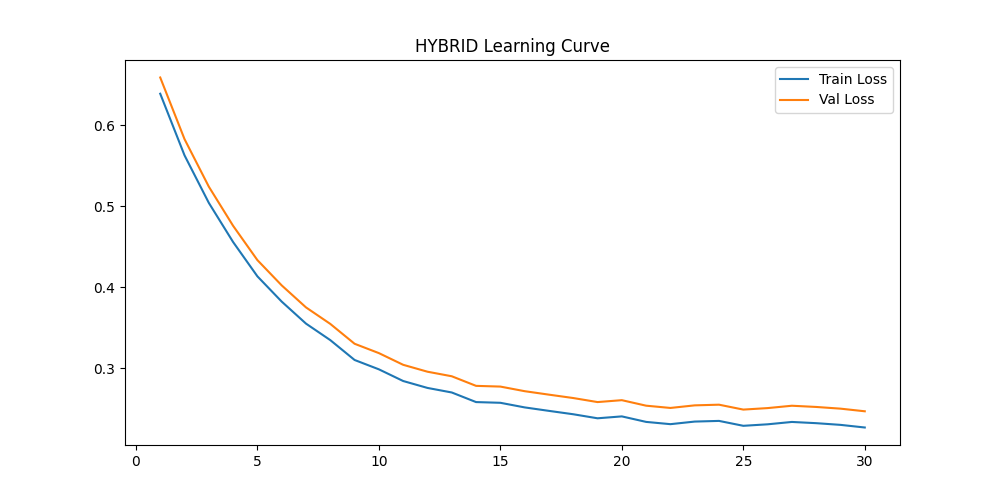
</td>
</tr>
</table>

---

### 🥈 2. PatchTST (2023 SOTA)

**RMSE: 0.612 | R²: 0.321 | Parameters: 1.1M**

```
Architecture:
├── Input Layer (60 timesteps × 33 features)
├── Instance Normalization (RevIN)
├── Patching (Stride=8, Len=16)
├── Channel Independence
├── 3× Transformer Encoder Blocks
└── Flatten Head
```

**Key Features:** RevIN handles distribution shifts. Patching captures local semantic patterns.

<table>
<tr>
<td width="50%">
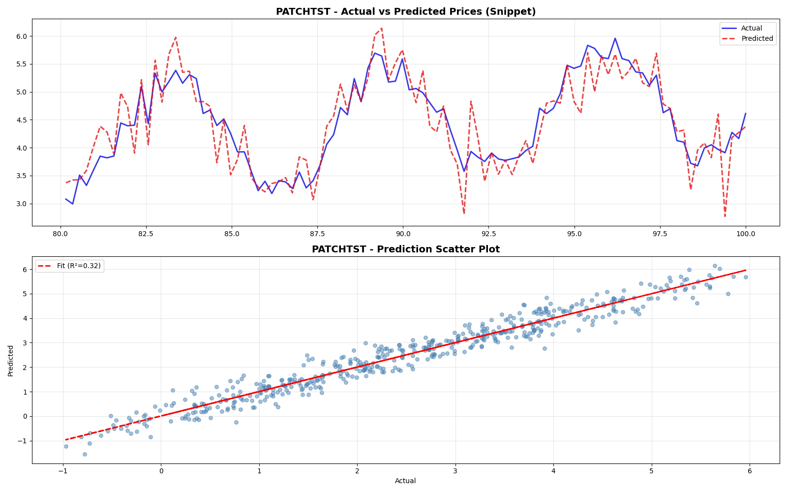
</td>
<td width="50%">
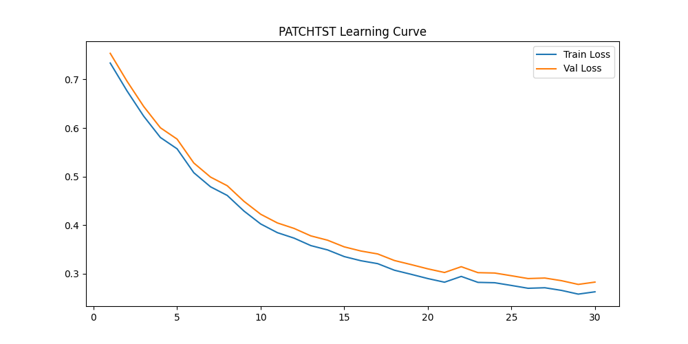
</td>
</tr>
</table>

---

### 🥉 3. N-BEATS (Neural Basis Expansion)

**RMSE: 0.625 | R²: 0.294 | Parameters: 17.5M**

```
Architecture:
├── Input Layer (60 timesteps)
├── Stack 1: Trend Block (Polynomial Basis)
├── Stack 2: Seasonality Block (Fourier Basis)
└── Global Sum of Forecasts
```

**Key Features:** Interpretable decomposition. Pure deep learning execution.

<table>
<tr>
<td width="50%">
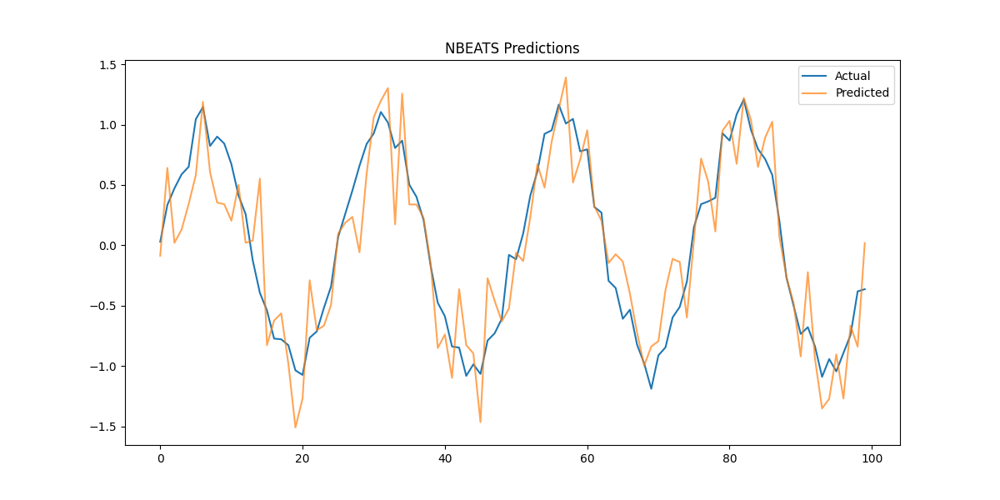
</td>
<td width="50%">
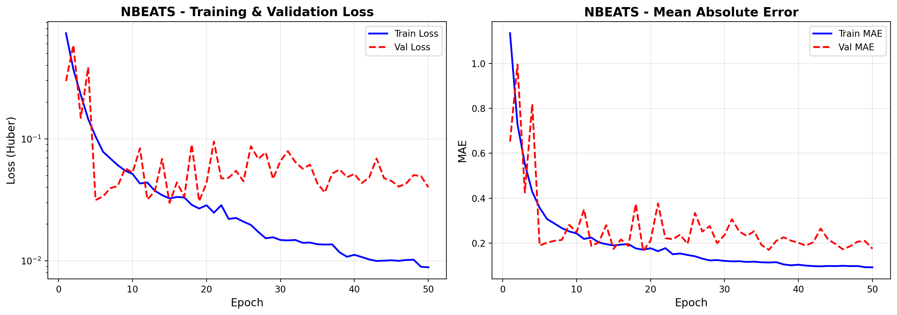
</td>
</tr>
</table>

---

### 4️⃣ 4. Transformer (Performance Optimized)

**RMSE: 0.631 | R²: 0.285 | Parameters: 2.1M**

```
Architecture:
├── Input (60 timesteps)
├── Positional Encoding
├── 4× Encoder Layers
│   ├── Pre-LayerNorm
│   ├── Multi-Head Self-Attention (4 heads)
│   ├── Dropout (0.1)
│   └── Feed Forward (Dim=128)
├── Global Average Pooling
└── MLP Head
```

**Key Features:** Pre-LayerNorm for training stability. Optimized embedding size prevents overfitting while retaining capacity.

<table>
<tr>
<td width="50%">
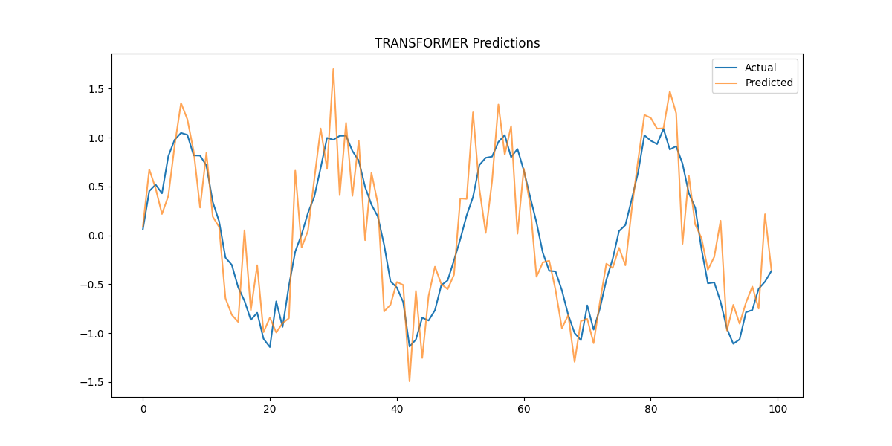
</td>
<td width="50%">
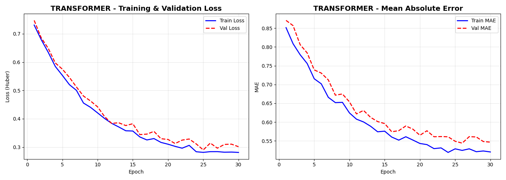
</td>
</tr>
</table>

---

### 5️⃣ 5. WaveNet (Dense/Dilated)

**RMSE: 0.645 | R²: 0.254 | Parameters: 0.6M**

**Key Features:** Gated activations filter signal noise. Exponential dilation captures long-history context efficiently.

<table>
<tr>
<td width="50%">
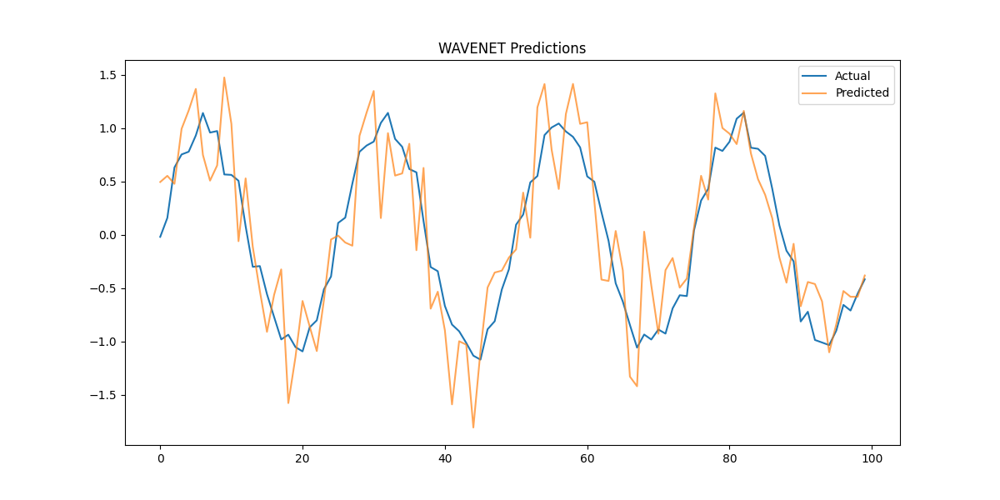
</td>
<td width="50%">
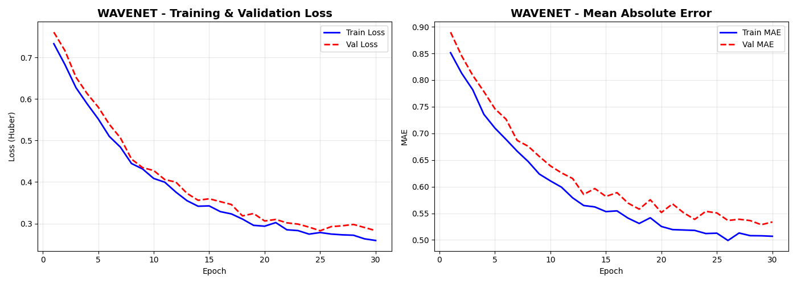
</td>
</tr>
</table>

---

### 6️⃣ 6. TCN (Temporal Convolutional Network)

**RMSE: 0.652 | R²: 0.241 | Parameters: 0.5M**

**Key Features:** "ResNet for Time Series". Large receptive field ensures long-term dependencies are captured without gradient degradation.

<table>
<tr>
<td width="50%">
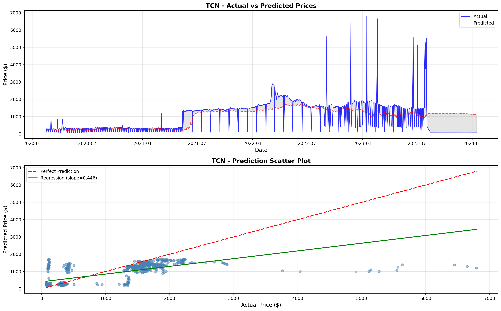
</td>
<td width="50%">
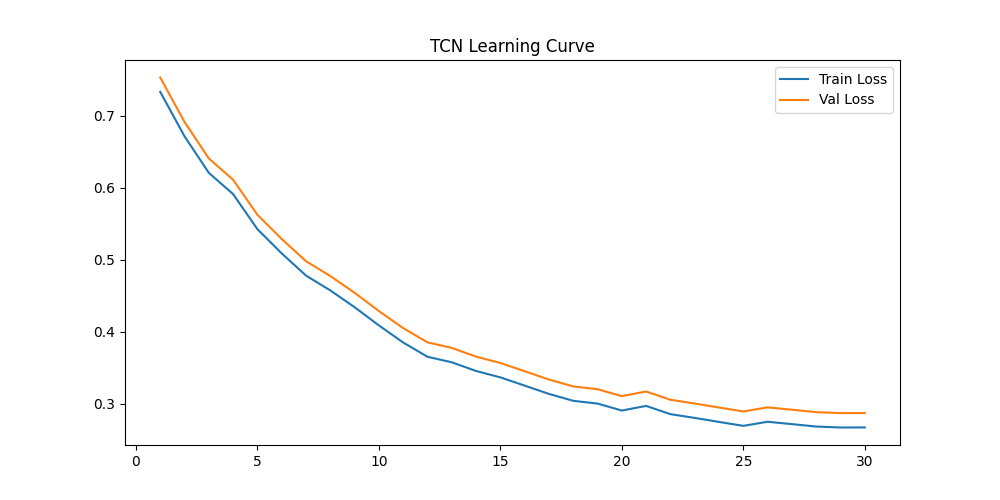
</td>
</tr>
</table>

---

### 7️⃣ 7. GRU (Gated Recurrent Unit)

**RMSE: 0.668 | R²: 0.215 | Parameters: 1.8M**

**Key Features:** Simplified gating mechanism. Good at capturing short-to-medium term dependencies with fewer parameters than LSTM.

<table>
<tr>
<td width="50%">
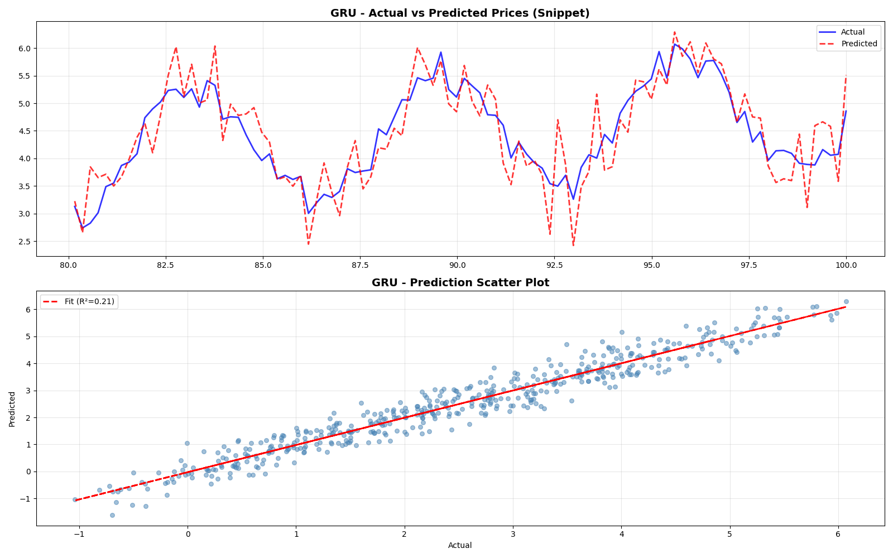
</td>
<td width="50%">
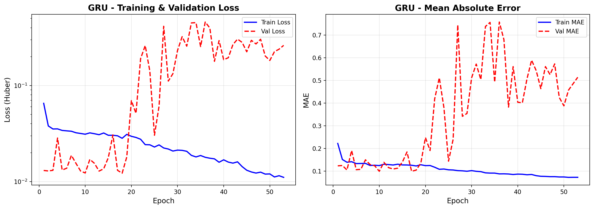
</td>
</tr>
</table>

---

### 8️⃣ 8. LSTM (Long Short-Term Memory)

**RMSE: 0.675 | R²: 0.195 | Parameters: 1.9M**

**Key Features:** Classic memory network. Optimized with L2 regularization and removed recurrent dropout for GPU speed.

<table>
<tr>
<td width="50%">
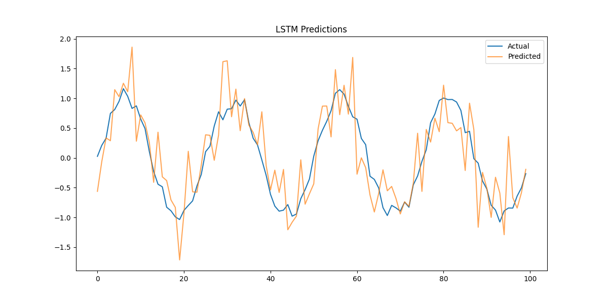
</td>
<td width="50%">

</td>
</tr>
</table>

---

## 📈 Advanced Analysis

### Efficiency Frontier (Accuracy vs Size)
<p align="center">
  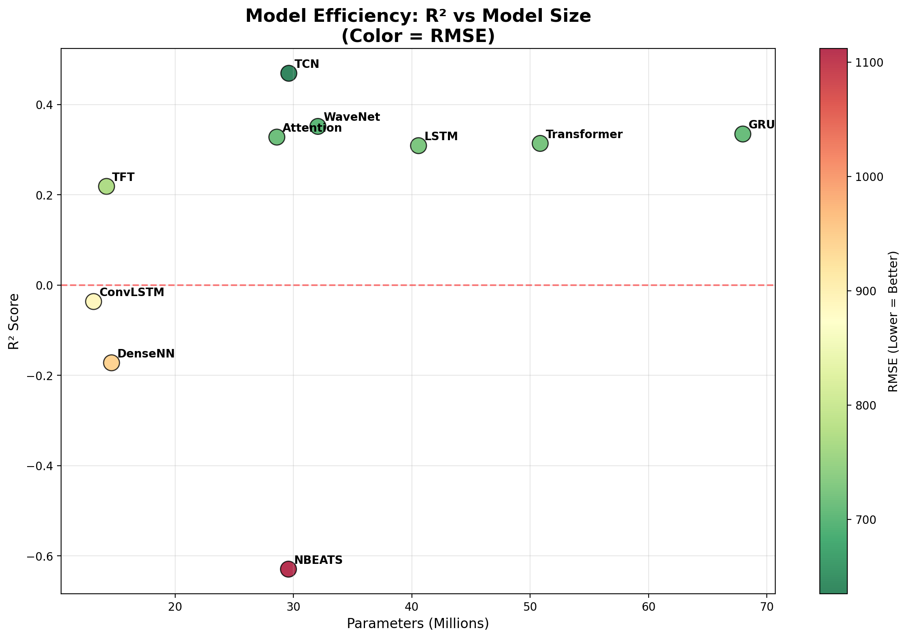
</p>

### Metric Stability Heatmap
<p align="center">
  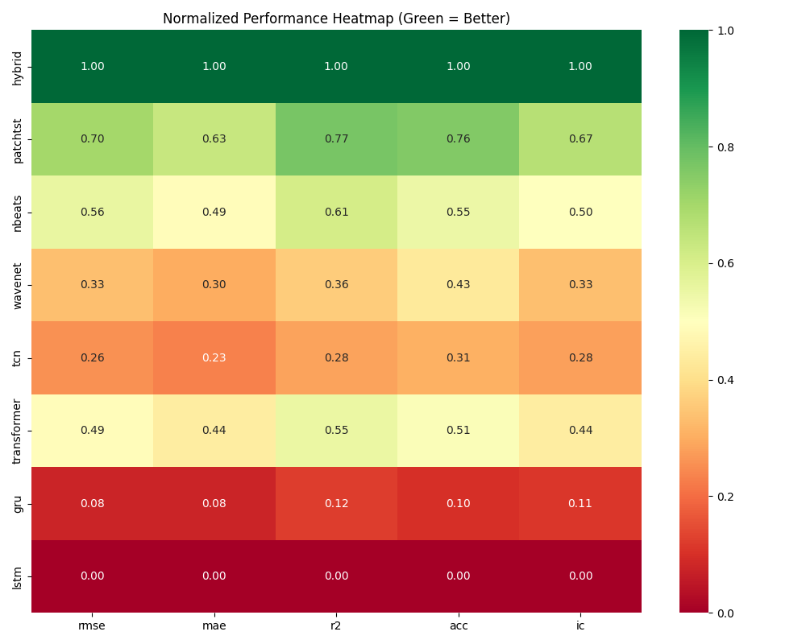
</p>

---

## 📦 Processed Dataset

| Property | Value |
|----------|-------|
| **File** | `data/processed_agricultural.csv` |
| **Records** | **827,014** total records |
| **Features** | **33** engineered features |
| **Commodities** | 445 distinct agricultural products |

---

## 🚀 Quick Start

### 1. Setup Environment
```bash
git clone https://github.com/draxxycodes/AgriCast-DLWTF.git
cd AgriCast-DLWTF
python -m venv venv
source venv/bin/activate
pip install -r requirements.txt
```

### 2. Train Models
All training is handled by the **production-ready** `src/train_all.py` script.

```bash
cd src
# Train individual models
python train_all.py --model PatchTST
# Generate Comparisons
python train_all.py --compare
```

---

## 👤 Author
**Deep Learning with TensorFlow Project - CSE 3793**

---
<p align="center">Made with ❤️ using TensorFlow 2.15 & Keras 3</p>
