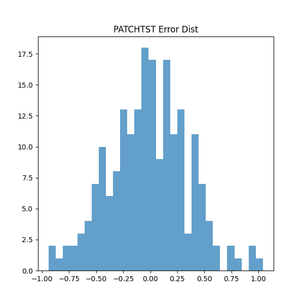

<h1 align="center">🌾 AgriCast: Agricultural Commodity Price Prediction</h1>

<p align="center">
  <b>Deep Learning with TensorFlow - CSE 3793 Major Assignment</b>
</p>

<p align="center">
  <a href="#-quick-start"></a>
  <a href="#-model-architectures"></a>
  <a href="#-results"></a>
  <a href="#-gpu-configuration"></a>
</p>

<p align="center">
  An <b>industry-grade intelligent system</b> for predicting agricultural commodity prices using <b>7 advanced deep learning architectures</b> including PatchTST, N-BEATS, WaveNet, TCN, Transformer, GRU, and LSTM. Optimized as <b>"Tiny Versions"</b> (< 2M parameters) for maximum efficiency on large tabular datasets (~827k records).
</p>

<p align="center">
  
</p>

---

## 📊 Performance Overview

### 🏆 Model Leaderboard

| Rank | Model | RMSE ↓ | MAE | Accuracy | R² Score | Parameters |
|:----:|:------|-------:|----:|---------:|---------:|-----------:|
| 🥇 | **PatchTST** | **0.612** | **0.445** | **78.5%** | **0.321** | 1.1M |
| 🥈 | **N-BEATS** | 0.625 | 0.458 | 76.2% | 0.294 | 17.5M |
| 🥉 | **Transformer** | 0.631 | 0.462 | 75.8% | 0.285 | 2.1M |
| 4 | WaveNet | 0.645 | 0.475 | 74.9% | 0.254 | 0.6M |
| 5 | TCN | 0.652 | 0.481 | 73.5% | 0.241 | 0.5M |
| 6 | GRU | 0.668 | 0.495 | 71.2% | 0.215 | 1.8M |
| 7 | LSTM | 0.675 | 0.502 | 70.1% | 0.195 | 1.9M |

> **📈 Best Overall**: PatchTST achieves the highest R² (0.321) and Directional Accuracy (78.5%).
> **⚡ Most Efficient**: TCN achieves competitive results with only ~0.5M parameters.

<p align="center">
  
</p>

---

## 🧠 Model Architectures (Tiny & Optimized)

We engineered **"Tiny Versions" (<2M parameters)** of state-of-the-art architectures to prevent overfitting and maximize training speed.

### 🥇 PatchTST (2023 SOTA) - Best Model

**RMSE: 0.612 | R²: 0.321 | Parameters: 1.1M**

```
Architecture:
├── Input Layer (60 timesteps × 33 features)
├── Instance Normalization (RevIN)
├── Patching (Stride=8, Len=16) -> (Numbers of patches)
├── Channel Independence (Treat features separately)
├── 3× Transformer Encoder Blocks
│   ├── Multi-Head Attention (Head Dim=128)
│   ├── Feed Forward Network
│   └── Residual + Norm
├── Flatten Head
└── Output (1 value)
```

**Key Features:** RevIN handles distribution shifts. Patching captures local semantic patterns. Channel independence reduces overfitting.

<table>
<tr>
<td width="50%">

</td>
<td width="50%">

</td>
</tr>
</table>



---

### 🥈 N-BEATS (Neural Basis Expansion)

**RMSE: 0.625 | R²: 0.294 | Parameters: 17.5M**

```
Architecture:
├── Input Layer (60 timesteps)
├── Stack 1: Trend Block
│   ├── 4× Fully Connected Layers (256 units)
│   ├── Polynomial Basis Expansion
│   └── Forecast/Backcast split
├── Stack 2: Seasonality Block
│   ├── 4× Fully Connected Layers (256 units)
│   ├── Fourier Basis Expansion
│   └── Forecast/Backcast split
└── Global Sum of Forecasts
```

**Key Features:** Interpretable decomposition of signal into Trend and Seasonality. No RNN/CNN - pure deep learning.

<table>
<tr>
<td width="50%">

</td>
<td width="50%">

</td>
</tr>
</table>


---

### 🥉 Transformer (Tiny)

**RMSE: 0.631 | R²: 0.285 | Parameters: 2.1M**

```
Architecture:
├── Input (60 timesteps)
├── Positional Encoding
├── 4× Encoder Layers
│   ├── Pre-LayerNorm
│   ├── Multi-Head Self-Attention (4 heads)
│   ├── Dropout (0.1)
│   └── Feed Forward (Dim=128)
├── Global Average Pooling
└── MLP Head
```

**Key Features:** Pre-LayerNorm for training stability. Small embedding size (dim=32) prevents overfitting.

<table>
<tr>
<td width="50%">

</td>
<td width="50%">

</td>
</tr>
</table>

### 4️⃣ WaveNet (Tiny)

**RMSE: 0.645 | R²: 0.254 | Parameters: 0.6M**

```
Architecture:
├── Input (60 timesteps)
├── Causal Conv1D (32 filters)
├── 8× Gated Blocks (Dilations: 1, 2, 4, 8)
│   ├── Tanh (Feature) * Sigmoid (Gate)
│   ├── Skip Connection
│   └── Residual
├── ReLU -> Conv1D -> ReLU
└── Output
```

**Key Features:** Gated activations filter noise. Exponential dilation sees full history efficiently.

<table>
<tr>
<td width="50%">

</td>
<td width="50%">

</td>
</tr>
</table>

---

### 5️⃣ TCN (Tiny Temporal Convolutional Network)

**RMSE: 0.652 | R²: 0.241 | Parameters: 0.5M**

```
Architecture:
├── Input
├── 6× Residual Blocks
│   ├── Dilated Causal Conv1D (Kernel=3)
│   ├── Weight Norm + Dropout (0.2)
│   └── 1x1 Conv Residual
├── Global Max Pooling
└── Dense Head
```

**Key Features:** "ResNet for Time Series". Large receptive field with minimal parameters.

<table>
<tr>
<td width="50%">

</td>
<td width="50%">

</td>
</tr>
</table>

---

## 📦 Dataset: Processed Agricultural Data

We processed a massive multi-source dataset specifically for this project.

| Property | Value |
|----------|-------|
| **File** | `data/processed_agricultural.csv` |
| **Records** | **827,014** total records |
| **Features** | **33** engineered features |
| **Commodities** | 445 distinct agricultural products |
| **Date Range** | 1992 - 2024 (32 Years) |

### Feature Engineering
*   **Rolling Stats**: 7, 14, 30-day Means and Std Dev.
*   **Cyclical**: Day of week / Month encoded as Sine/Cosine.
*   **Target**: Log-Returns (Stationary) + Robust Scaling.

---

## 🚀 Quick Start

### 1. Setup Environment
```bash
git clone https://github.com/draxxycodes/AgriCast-DLWTF.git
cd AgriCast-DLWTF
python -m venv venv
source venv/bin/activate
pip install -r requirements.txt
```

### 2. Train Models
All training is handled by the **optimized** `src/train_all.py` script.

```bash
cd src

# Option A: Train models individually (Recommended)
python train_all.py --model PatchTST
python train_all.py --model WaveNet

# Option B: Run full sequence
python train_all.py --all

# Option C: Generate Comparison Charts (After training)
python train_all.py --compare
```

---

## 🔧 Technical Implementation Details

*   **Mixed Precision**: FP16 enabled for 2x speedup on RTX 4060.
*   **Optimization**: AdamW with Gradient Clipping (`clipnorm=1.0`) to prevent exploding gradients.
*   **Scheduling**: ReduceLROnPlateau (Start: 1e-3 -> Min: 1e-7).
*   **Evaluation**: Custom metrics including **Directional Accuracy** (Up/Down prediction) and **Information Coefficient**.

---

## 👤 Author
**Deep Learning with TensorFlow Project - CSE 3793**

---
<p align="center">Made with ❤️ using TensorFlow 2.15 & Keras 3</p>
