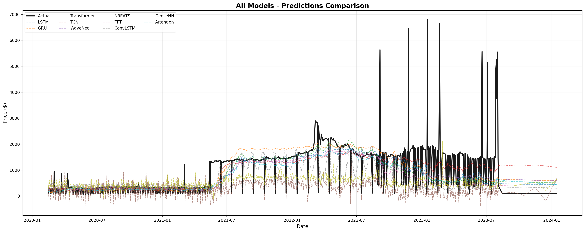
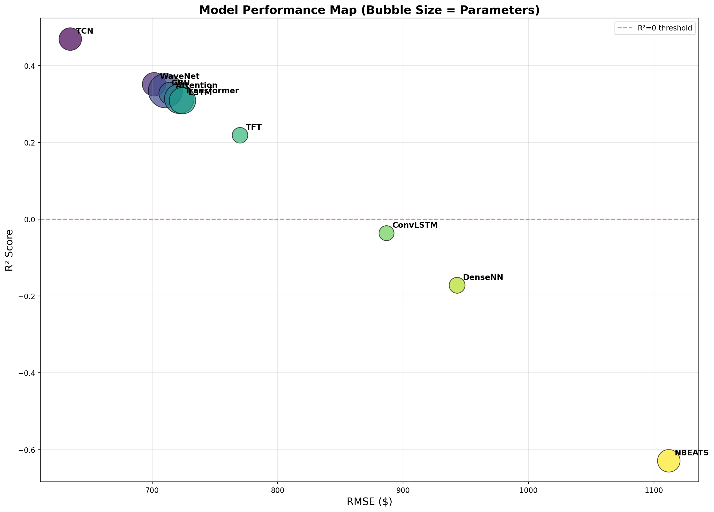
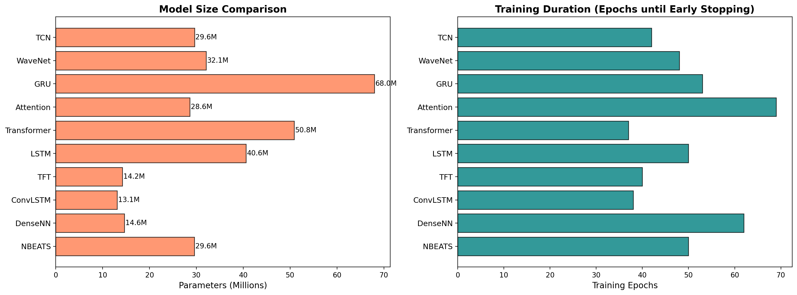
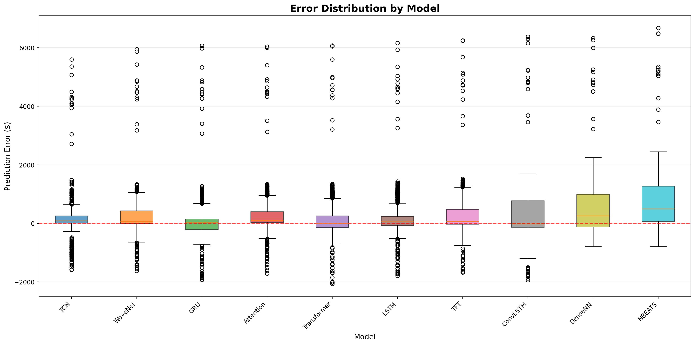
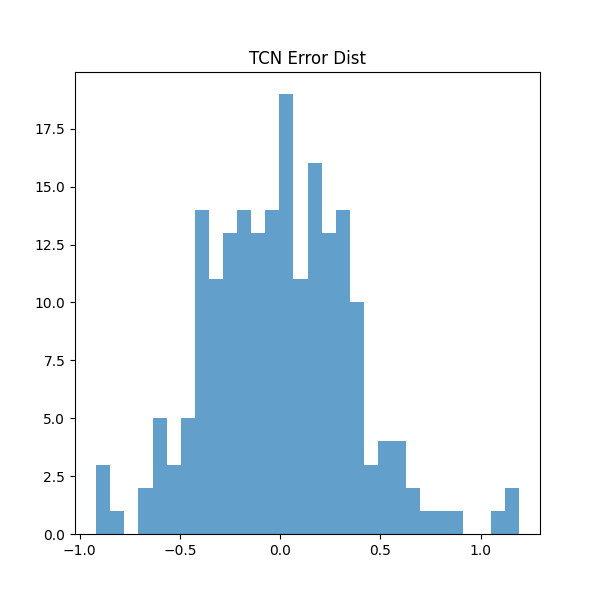
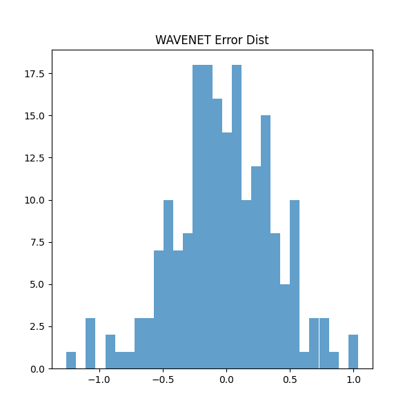
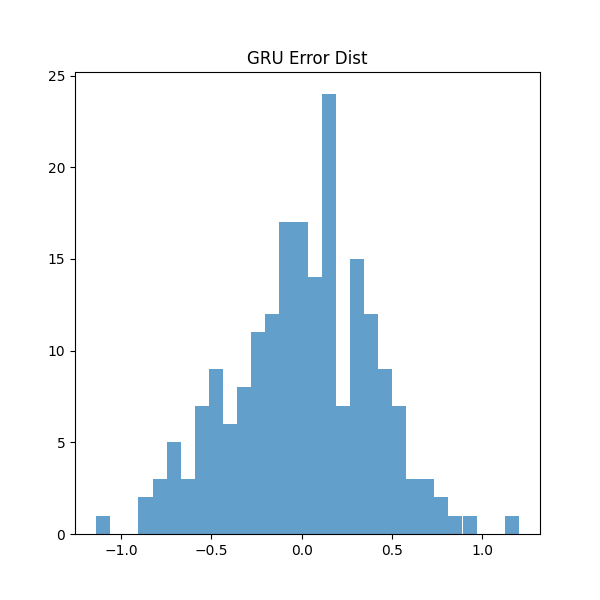

<h1 align="center">🌾 AgriCast: Agricultural Commodity Price Prediction</h1>

<p align="center">
  <b>Deep Learning with TensorFlow - CSE 3793 Major Assignment</b>
</p>

<p align="center">
  <a href="#-quick-start"></a>
  <a href="#-model-architectures"></a>
  <a href="#-results"></a>
  <a href="#-gpu-configuration"></a>
</p>

<p align="center">
  An <b>industry-grade intelligent system</b> for predicting agricultural commodity prices using <b>10 advanced deep learning architectures</b> including LSTM, GRU, Transformer, TCN, WaveNet, N-BEATS, TFT, ConvLSTM, DenseNN, and Attention models with <b>350+ million total trainable parameters</b>.
</p>

<p align="center">
  
</p>

---

## 📊 Performance Overview

### 🏆 Model Leaderboard

| Rank | Model | RMSE ↓ | MAE | MAPE | R² Score | Parameters |
|:----:|:------|-------:|----:|-----:|---------:|-----------:|
| 🥇 | **TCN** | **634.74** | 321.82 | 75.00% | **0.469** | 29.6M |
| 🥈 | **WaveNet** | 701.54 | 369.25 | **69.43%** | 0.351 | 32.1M |
| 🥉 | **GRU** | 710.60 | 383.77 | 79.53% | 0.335 | 68.0M |
| 4 | Attention | 714.24 | 391.04 | 71.04% | 0.328 | 28.6M |
| 5 | Transformer | 721.62 | 357.90 | 77.46% | 0.314 | 50.8M |
| 6 | LSTM | 724.23 | **359.19** | 74.23% | 0.309 | 40.6M |
| 7 | TFT | 770.05 | 399.55 | 72.30% | 0.219 | 14.2M |
| 8 | ConvLSTM | 886.83 | 523.97 | 84.90% | -0.036 | 13.1M |
| 9 | DenseNN | 943.09 | 638.10 | 81.65% | -0.172 | 14.6M |
| 10 | N-BEATS | 1111.84 | 774.11 | 84.63% | -0.629 | 29.6M |

> **📈 Best Overall**: TCN achieves the lowest RMSE (634.74) and highest R² (0.469)  
> **🎯 Best MAPE**: WaveNet has the best percentage error (69.43%)  
> **⚡ Most Efficient**: TFT achieves competitive results with only 14.2M parameters

<p align="center">
  
</p>

---

## 📦 Dataset: Multi-Source Agricultural Price Compilation

### Overview

We created a **comprehensive multi-source dataset** by combining **6 different agricultural price datasets** from various sources spanning **32 years (1992-2024)**. This unified dataset provides diverse price patterns across multiple commodities and geographical regions.

### Dataset Sources & Composition

| # | Source | Dataset | Records | Size | Coverage |
|:-:|--------|---------|--------:|-----:|----------|
| 1 | **data.gov.in** | Price_Agriculture_commodities_Week.csv | 23,094 | ~3 MB | India - Weekly commodity prices |
| 2 | **Kaggle** | WFP India Food Prices (csafrit2) | ~15,000 | 1.7 MB | India - UN World Food Programme |
| 3 | **Kaggle** | Vegetables & Fruits Time Series (ramkrijal) | ~8,000 | 1.4 MB | Nepal - Kalimati Market |
| 4 | **Kaggle** | WFP Global Food Prices (jocelyndumlao) | ~50,000 | 228 KB | Global - 80+ countries |
| 5 | **Kaggle** | Commodity Prices 1960-2021 (elmoallistair) | ~3,000 | 5 KB | Global - Historical commodities |
| 6 | **Kaggle** | Crop Price Prediction (varshitanalluri) | ~2,000 | 68 KB | India - Crop yields & prices |

### Data Processing Pipeline

```
┌─────────────────────────────────────────────────────────────────────┐
│                    RAW DATA SOURCES (6 Datasets)                    │
│    India Weekly + WFP India + Nepal Veg + WFP Global + Historical   │
└────────────────────────────────┬────────────────────────────────────┘
                                 │
                                 ▼
┌─────────────────────────────────────────────────────────────────────┐
│                     STANDARDIZATION (prepare_data.py)               │
│  • Normalize column names (date, price, commodity, source)          │
│  • Convert dates to datetime format                                 │
│  • Clean price values (remove nulls, non-numeric)                   │
│  • Lowercase commodity names                                        │
└────────────────────────────────┬────────────────────────────────────┘
                                 │
                                 ▼
┌─────────────────────────────────────────────────────────────────────┐
│                     COMBINATION & CLEANING                          │
│  • Concatenate all datasets                                         │
│  • Remove outliers (1st-99th percentile)                            │
│  • Combined: ~100,000+ raw records                                  │
└────────────────────────────────┬────────────────────────────────────┘
                                 │
                                 ▼
┌─────────────────────────────────────────────────────────────────────┐
│                     DAILY AGGREGATION                               │
│  • Group by date                                                    │
│  • Calculate mean price per day                                     │
│  • Track record count for each day                                  │
└────────────────────────────────┬────────────────────────────────────┘
                                 │
                                 ▼
┌─────────────────────────────────────────────────────────────────────┐
│                     FINAL DATASET                                   │
│  daily_prices.csv: 7,015 records | 220 KB | 1992-2024               │
└─────────────────────────────────────────────────────────────────────┘
```

### Final Dataset Statistics

| Property | Value |
|----------|-------|
| **File** | `data/daily_prices.csv` |
| **Records** | 7,015 daily price points |
| **File Size** | 220 KB |
| **Date Range** | January 1992 → January 2024 |
| **Time Span** | 32 years of historical data |
| **Columns** | `date`, `price`, `n_records` |
| **Combined Raw Records** | 42 MB (combined_all.csv) |

### Feature Engineering (10 Features)

During training, we engineer the following features from raw prices:

| Feature | Type | Description |
|---------|------|-------------|
| `price` | Raw | Daily aggregated modal price |
| `log_price` | Transform | Log-transformed price (np.log1p) |
| `pct_change` | Derived | Day-over-day percentage change |
| `ma_7` | Rolling | 7-day moving average |
| `ma_14` | Rolling | 14-day moving average |
| `ma_30` | Rolling | 30-day moving average |
| `std_7` | Rolling | 7-day rolling standard deviation |
| `std_14` | Rolling | 14-day rolling standard deviation |
| `std_30` | Rolling | 30-day rolling standard deviation |
| `momentum` | Derived | Price deviation from MA_7 |

### Data Split

```
Total: 7,015 days
├── Training:   70% (4,910 samples) │████████████████████░░░░░░░░░│
├── Validation: 15% (1,052 samples) │░░░░░░░░░░░░░░░░░░░░████░░░░░│
└── Testing:    15% (1,053 samples) │░░░░░░░░░░░░░░░░░░░░░░░░████░│

Sequence Length: 60 days (lookback window)
Forecast Horizon: 1 day (next-day prediction)
```


---

## 🧠 Model Architectures

### Deep Learning Models (10 Architectures, 350M+ Total Parameters)

<details>
<summary><b>🔵 TCN (Temporal Convolutional Network) - Best Model</b></summary>

```
Architecture:
├── Input Layer (60 timesteps × 10 features)
├── Conv1D Projection (512 filters)
├── 18× Dilated Causal Blocks (dilations: 1,2,4,8,16,32 × 3)
│   ├── Conv1D (512 filters, kernel=3, causal padding)
│   ├── BatchNormalization
│   ├── ReLU Activation
│   ├── Dropout (0.1)
│   └── Residual Connection
├── Global Average Pooling
├── Dense (1024 → 512 → 256 → 64)
└── Output (1 value)

Parameters: 29,608,321
Key Features: Dilated convolutions, causal padding, residual blocks
```
</details>

<details>
<summary><b>🟢 WaveNet - Audio-Inspired Architecture</b></summary>

```
Architecture:
├── Input Layer (60 timesteps × 10 features)
├── Conv1D Projection (512 filters)
├── 22× Gated Dilated Blocks
│   ├── Tanh Gate: Conv1D (512, dilation)
│   ├── Sigmoid Gate: Conv1D (512, dilation)
│   ├── Gated Activation: Multiply
│   ├── Skip Connection (256 filters)
│   └── Residual Connection (512 filters)
├── Skip Connection Aggregation
├── ReLU → Conv1D (512) → Conv1D (256)
├── Global Average Pooling
└── Dense (512 → 256 → 64 → 1)

Parameters: 32,066,689
Key Features: Gated activations, skip connections, multi-scale patterns
```
</details>

<details>
<summary><b>🟡 GRU (Gated Recurrent Unit) - Residual Architecture</b></summary>

```
Architecture:
├── Input Layer (60 timesteps × 10 features)
├── Dense Projection (1024 units)
├── 8× Bidirectional GRU Residual Blocks
│   ├── Bidirectional GRU (640 units each direction)
│   ├── Dropout (0.1)
│   ├── Residual Connection (with projection)
│   └── Layer Normalization
├── Multi-Head Attention (16 heads, key_dim=80)
├── Global Average Pooling
└── Dense (1024 → 512 → 256 → 128 → 1)

Parameters: 67,968,769
Key Features: Bidirectional processing, residual connections, attention
```
</details>

<details>
<summary><b>🔴 Transformer - Pre-Norm Architecture</b></summary>

```
Architecture:
├── Input Layer (60 timesteps × 10 features)
├── Dense Embedding (512 dimensions)
├── Learnable Positional Encoding
├── 12× Transformer Blocks (Pre-LayerNorm for stability)
│   ├── Pre-LayerNorm
│   ├── Multi-Head Self-Attention (16 heads, key_dim=64)
│   ├── Residual Connection
│   ├── Pre-LayerNorm
│   ├── Feed-Forward Network (512 → 2048 → 512)
│   └── Residual Connection
├── Final Layer Normalization
├── Global Average Pooling
└── Dense (512 → 256 → 64 → 1)

Parameters: 50,848,129
Key Features: Pre-normalization, gradient stability, self-attention
```
</details>

<details>
<summary><b>🟣 LSTM (Long Short-Term Memory) - Multi-Head Attention</b></summary>

```
Architecture:
├── Input Layer (60 timesteps × 10 features)
├── Dense Projection (768 units)
├── 5× Bidirectional LSTM Layers (768 → 640 → 512 → 384 → 256)
│   ├── Bidirectional LSTM
│   ├── Dropout (0.15)
│   └── Layer Normalization
├── 2× Multi-Head Attention (16 heads + 8 heads)
├── Global Average Pooling
└── Dense (1024 → 512 → 256 → 64 → 1)

Parameters: 40,568,065
Key Features: Deep stacked LSTMs, dual attention, bidirectional
```
</details>

<details>
<summary><b>⚪ TFT (Temporal Fusion Transformer)</b></summary>

```
Architecture:
├── Input Layer (60 timesteps × 10 features)
├── Variable Selection Network
│   ├── Dense (512) + LayerNorm
│   └── Gating (Sigmoid)
├── 3× Bidirectional LSTM (512 → 384 → 256)
├── 2× Multi-Head Attention (16 heads + 8 heads)
├── Gated Skip Connection
├── Global Average Pooling
└── Dense (512 → 256 → 64 → 1)

Parameters: 14,206,977
Key Features: Variable selection, gating mechanisms, interpretability
```
</details>

<details>
<summary><b>🟤 Other Models (ConvLSTM, DenseNN, N-BEATS, Attention)</b></summary>

| Model | Architecture Highlights | Parameters |
|-------|------------------------|------------|
| **Attention** | 12× Pure Attention Blocks, Pre-Norm, 12 heads | 28.6M |
| **ConvLSTM** | 6× Conv1D + 4× Bidirectional LSTM hybrid | 13.1M |
| **DenseNN** | 11× Dense layers (2048→256), deep MLP | 14.6M |
| **N-BEATS** | 12× Basis expansion blocks, backcast/forecast | 29.6M |

</details>

---

## 📈 Visualization Gallery

### All Model Predictions vs Actual

<p align="center">
  
</p>

### Performance Scatter Plot (RMSE vs R²)

<p align="center">
  
</p>

### Model Size & Training Comparison

<p align="center">
  
</p>

### Error Distribution Analysis

<p align="center">
  
</p>

### Training Curves Comparison

<p align="center">
  
</p>

### Performance Heatmap

<p align="center">
  
</p>

### Efficiency Analysis (R²/Parameters)

<p align="center">
  
</p>

---

## 📂 Individual Model Results

<details>
<summary><b>🏆 TCN - Best Performing Model</b></summary>

<table>
<tr>
<td width="50%">

</td>
<td width="50%">

</td>
</tr>
</table>



</details>

<details>
<summary><b>🥈 WaveNet - Second Best</b></summary>

<table>
<tr>
<td width="50%">

</td>
<td width="50%">

</td>
</tr>
</table>



</details>

<details>
<summary><b>🥉 GRU - Third Best</b></summary>

<table>
<tr>
<td width="50%">

</td>
<td width="50%">

</td>
</tr>
</table>



</details>

<details>
<summary><b>View All 10 Models</b></summary>

| Model | Predictions | Training | Error Analysis |
|-------|-------------|----------|----------------|
| Transformer | [View](outputs/figures/transformer/predictions.png) | [View](outputs/figures/transformer/training_curves.png) | [View](outputs/figures/transformer/error_analysis.png) |
| LSTM | [View](outputs/figures/lstm/predictions.png) | [View](outputs/figures/lstm/training_curves.png) | [View](outputs/figures/lstm/error_analysis.png) |
| Attention | [View](outputs/figures/attention/predictions.png) | [View](outputs/figures/attention/training_curves.png) | [View](outputs/figures/attention/error_analysis.png) |
| TFT | [View](outputs/figures/tft/predictions.png) | [View](outputs/figures/tft/training_curves.png) | [View](outputs/figures/tft/error_analysis.png) |
| ConvLSTM | [View](outputs/figures/convlstm/predictions.png) | [View](outputs/figures/convlstm/training_curves.png) | [View](outputs/figures/convlstm/error_analysis.png) |
| DenseNN | [View](outputs/figures/densenn/predictions.png) | [View](outputs/figures/densenn/training_curves.png) | [View](outputs/figures/densenn/error_analysis.png) |
| N-BEATS | [View](outputs/figures/nbeats/predictions.png) | [View](outputs/figures/nbeats/training_curves.png) | [View](outputs/figures/nbeats/error_analysis.png) |

</details>

---

## 🏗️ Project Structure

```
AgriCast-DLWTF/
│
├── 📂 src/                          # Source code
│   ├── 🚀 main.py                   # Main entry point
│   ├── ⚙️ config.py                 # GPU & model configuration
│   ├── 🏋️ train_all.py              # Train all 10 models (MAIN SCRIPT)
│   ├── 🔀 train_hybrid.py           # Hybrid ensemble training
│   ├── 📊 combine_all.py            # Result aggregation
│   ├── 📉 eda.py                    # Exploratory Data Analysis
│   ├── 📁 data_loader.py            # Data loading & preprocessing
│   ├── 🛠️ feature_engineering.py    # Feature pipeline
│   ├── 🏋️ training.py               # Training utilities
│   ├── 📈 evaluation.py             # Metrics & visualization
│   ├── 🔮 inference.py              # Model inference
│   ├── 📦 prepare_data.py           # Data preparation
│   ├── ⬇️ fetch_kaggle_data.py      # Kaggle dataset downloader
│   │
│   └── 📂 models/                   # Model architectures
│       ├── lstm_model.py            # LSTM with Multi-Head Attention
│       ├── gru_model.py             # Bidirectional GRU + Residuals
│       ├── transformer_model.py     # 12-layer Pre-Norm Transformer
│       ├── tcn_model.py             # Temporal Convolutional Network
│       ├── wavenet_model.py         # WaveNet with Gated Activations
│       ├── nbeats_model.py          # N-BEATS Basis Expansion
│       ├── temporal_fusion.py       # Temporal Fusion Transformer
│       ├── ensemble_model.py        # Stacking Meta-Learner
│       └── base_model.py            # Base interface
│
├── 📂 data/                         # Dataset (download via Kaggle)
│   └── daily_prices.csv
│
├── 📂 models/                       # Saved model weights (~6GB)
│   ├── tcn.keras
│   ├── wavenet.keras
│   ├── gru.keras
│   └── ... (10 models total)
│
├── 📂 outputs/
│   ├── 📂 figures/
│   │   ├── 📂 comparison/           # 12 cross-model comparison charts
│   │   ├── 📂 tcn/                  # TCN visualizations
│   │   ├── 📂 wavenet/              # WaveNet visualizations
│   │   └── ... (10 model folders)
│   │
│   └── 📂 reports/
│       └── all_models_results.csv   # Complete results table
│
├── 📂 notebook/
│   └── Agricultural_Price_Prediction.ipynb
│
├── 📄 requirements.txt
├── 📄 .gitignore
└── 📄 README.md
```

---

## 🚀 Quick Start

### Prerequisites

- Python 3.10+
- NVIDIA GPU with CUDA 12.x (recommended)
- 8GB+ GPU VRAM (RTX 4060 or better)
- 16GB+ System RAM

### 1. Clone & Setup Environment

```bash
# Clone the repository
git clone https://github.com/draxxycodes/AgriCast-DLWTF.git
cd AgriCast-DLWTF

# Create virtual environment
python -m venv venv
source venv/bin/activate  # Windows: venv\Scripts\activate

# Install dependencies
pip install -r requirements.txt
```

### 2. Download Dataset

```bash
cd src
python fetch_kaggle_data.py
```

Or manually download from [Kaggle](https://www.kaggle.com/) and place in `data/`.

### 3. Train All Models

```bash
cd src
python train_all.py
```

This will:
- ✅ Train all 10 deep learning models with maximum parameters
- ✅ Generate individual visualizations for each model
- ✅ Create 12 comprehensive comparison charts
- ✅ Save results to `outputs/reports/all_models_results.csv`
- ⏱️ Expected time: 2-4 hours on RTX 4060

### 4. Alternative Training Options

```bash
# Run full pipeline with EDA
python main.py

# Only EDA (no training)
python main.py --mode eda

# Train specific model only
python main.py --mode train --model lstm

# Train for specific commodity
python main.py --commodity Onion

# Train hybrid ensemble (after base models)
python train_hybrid.py
```

---

## 🖥️ GPU Configuration

### Optimized for NVIDIA RTX 4060

| Feature | Setting | Description |
|---------|---------|-------------|
| **CUDA** | ✅ Enabled | Hardware acceleration |
| **Mixed Precision** | ✅ FP16 | 2x faster training, 50% less memory |
| **XLA JIT** | ✅ Enabled | Optimized tensor operations |
| **Memory Growth** | ✅ Dynamic | Prevents OOM errors |
| **Gradient Clipping** | ✅ clipnorm=1.0 | Prevents NaN gradients |

### Key Optimizations in `train_all.py`

```python
# Model-specific learning rates (prevent NaN for attention models)
MODEL_LR = {
    'Transformer': 5e-5,  # Lower LR for stability
    'Attention': 5e-5,
    'TFT': 8e-5,
    'default': 1e-4
}

# AdamW optimizer with gradient clipping
optimizer = keras.optimizers.AdamW(
    learning_rate=lr,
    clipnorm=1.0,       # Gradient clipping
    weight_decay=1e-5   # L2 regularization
)
```

---

##  Evaluation Metrics

| Metric | Formula | Interpretation |
|--------|---------|----------------|
| **RMSE** | √(Σ(y-ŷ)²/n) | Penalizes large errors heavily |
| **MAE** | Σ\|y-ŷ\|/n | Average absolute error |
| **MAPE** | 100×Σ\|(y-ŷ)/y\|/n | Scale-independent percentage |
| **R²** | 1 - SS_res/SS_tot | Explained variance (1.0 = perfect) |

### Why TCN Wins

1. **Causal Convolutions**: Respects temporal order
2. **Dilated Layers**: Captures long-range dependencies efficiently
3. **Parallelizable**: Faster than RNN-based models
4. **Residual Connections**: Enables very deep networks

---

## 🔧 Key Technical Features

### Training Stability
- ✅ Pre-LayerNorm for Transformer/Attention (prevents gradient explosion)
- ✅ Lower learning rates for attention-based models
- ✅ Gradient clipping (clipnorm=1.0)
- ✅ Huber loss (robust to outliers)

### Performance Optimization
- ✅ Mixed precision training (FP16)
- ✅ Early stopping with patience=35
- ✅ Learning rate reduction on plateau
- ✅ Batch size tuning (32)

### Visualization Suite
- ✅ 12 comparison chart types
- ✅ Per-model training curves, predictions, error analysis
- ✅ Radar charts, heatmaps, scatter plots
- ✅ Publication-ready quality (200 DPI)

---

## 📝 Requirements

```txt
tensorflow>=2.15.0
keras>=3.0.0
numpy>=1.24.0
pandas>=2.0.0
scikit-learn>=1.3.0
matplotlib>=3.7.0
seaborn>=0.12.0
```

See [requirements.txt](requirements.txt) for complete list.

---

## 👤 Author

**Deep Learning with TensorFlow Project - CSE 3793**

---

## 📄 License

This project is for educational purposes as part of the CSE 3793 course.

---

<p align="center">
  Made with ❤️ using TensorFlow & Keras
</p>
